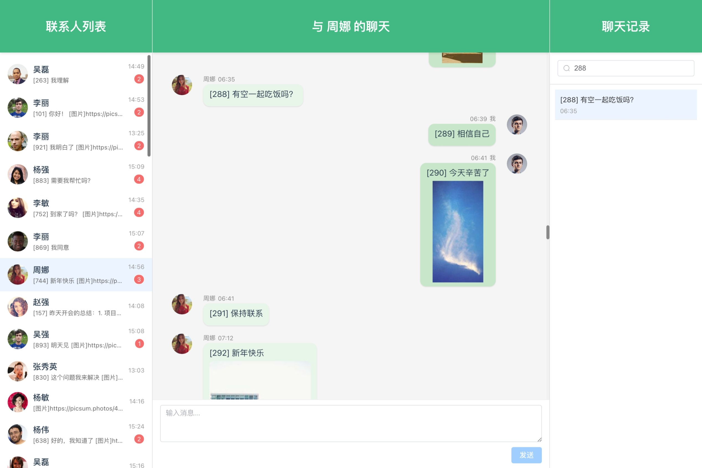

# Vue 聊天应用

用 cursor 给老婆写的一个聊天 app 基础 demo，具有以下特点：

- 后端数据 mock
- 支持图片消息
- 支持图片预览
- 支持聊天记录搜索
- 支持历史消息加载
- 使用虚拟滚动 + 异步加载的方案来处理大量消息导致的聊天列表性能问题



## 技术栈

### 前端

- Vue3
- vue-virtual-scroller (虚拟滚动组件)
- Element Plus (UI 组件库)
- Axios (HTTP 客户端)

### 后端

- Node.js
- Express
- Mock.js (模拟数据)

## 项目结构

``` shell
vue-chat-app/
├── fe/                 # 前端项目目录
│   ├── src/           # 源代码
│   ├── public/        # 静态资源
│   └── package.json   # 前端依赖配置
├── be/                 # 后端项目目录
│   ├── routes/        # 路由处理
│   ├── mock/          # 模拟数据
│   └── package.json   # 后端依赖配置
└── README.md          # 项目说明文档
```

## 功能特性

1. 聊天功能
   - 发送文本消息
   - 发送图片消息
   - 图片预览
   - 消息时间显示
   - 自动滚动到最新消息

2. 联系人管理
   - 联系人列表
   - 未读消息提醒
   - 最后一条消息预览
   - 最后消息时间显示

3. 聊天记录
   - 历史消息加载
   - 聊天记录搜索
   - 记录快速定位
   - 支持上下滚动加载更多

4. 性能优化
   - 虚拟滚动
   - 图片懒加载
   - 消息分页加载

## 如何启动项目

### 1. 安装依赖

首先需要分别安装前端和后端的依赖：

```bash
# 安装前端依赖
cd fe
pnpm install

# 安装后端依赖
cd ../be
pnpm install
```

### 2. 启动后端服务

```bash
# 在 be 目录下
pnpm dev
```

后端服务将在 <http://localhost:3001> 启动

### 3. 启动前端开发服务器

```bash
# 在 fe 目录下
pnpm dev
```

前端开发服务器将在 <http://localhost:5173> 启动

### 4. 访问应用

打开浏览器访问 <http://localhost:5173> 即可看到聊天应用界面

## 开发说明

### 前端开发

- 主要代码在 `fe/src` 目录下
- 使用 Vue 3 组合式 API
- 使用 Element Plus 组件库
- 使用 Vue Virtual Scroller 实现虚拟滚动

### 后端开发

- 主要代码在 `be/routes` 目录下
- 使用 Express 框架
- 使用 Mock.js 生成模拟数据
- 支持分页加载和消息搜索

## 注意事项

1. 确保 Node.js 版本 >= 14
2. 前后端需要分别启动
3. 很基础的 demo, 核心在虚拟列表 + 上下滚动异步加载
